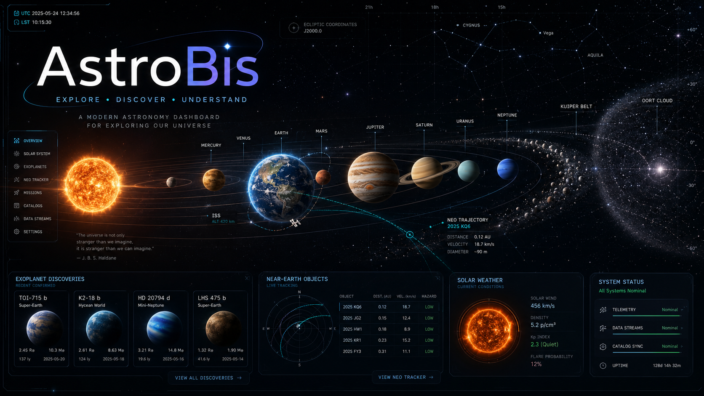

# AstroBis

AstroBis is an interactive astronomy platform built with Astro, React, Three.js, and live public space-data APIs. It focuses on realistic 3D exploration, current reference data, and browser-native visual tools.

**Website:** https://biswajit1999.github.io/AstroBis/

## Features

- **Solar System Atlas** - Explore the Sun, planets, dwarf planets, asteroid belt, Kuiper belt, heliopause, and Oort Cloud on a compressed real-distance scale.
- **Exoplanet Archive** - Browse NASA Exoplanet Archive composite parameters with planet type, orbit, mass, radius, temperature, stellar metadata, luminosity-derived habitable-zone proxies, and source links.
- **ISS Mission Control** - Track the International Space Station using CelesTrak TLE data and SGP4 propagation over a textured 3D Earth with subsolar lighting, clouds, city lights, telemetry, orbit projection, and ground-track map.
- **NEO Watch** - Query JPL close-approach data through 2050 with miss distance, velocity, size estimates, energy scale, and risk-proxy filters.
- **3D Stellar Atlas** - Navigate bright stars using real RA/Dec coordinates, spectral colors, constellation guides, distance shells, luminosity proxies, and an H-R style inset.
- **NASA APOD** - Display the Astronomy Picture of the Day with scientific context.

## Tech Stack

- Astro 4
- React 18
- Three.js and @react-three/fiber
- @react-three/drei
- Tailwind CSS
- NASA Exoplanet Archive TAP
- JPL SBDB Close-Approach Data API
- CelesTrak GP/TLE data
- satellite.js SGP4/SDP4 propagation

## Local Development

```bash
npm install
npm run dev
```

Build for production:

```bash
npm run build
```

Preview the static build:

```bash
npm run preview
```

## Deployment

The project is configured for GitHub Pages under `/AstroBis` using Astro's `site` and `base` settings.

The GitHub Pages workflow builds the Astro site and refreshes the public exoplanet and near-Earth object data snapshots on a daily schedule.

## Author

Created by Biswajit Jana.

Academic portfolio: https://biswajit1999.github.io/Biswajit_Jana.github.io/

## License

MIT
