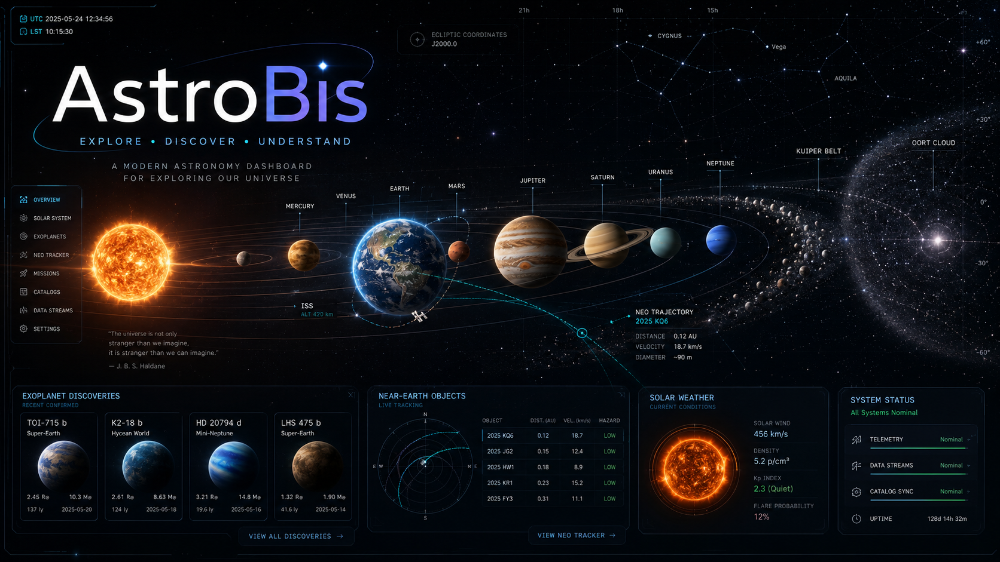

# AstroBis

[](https://biswajit1999.github.io/AstroBis/)
[](https://astro.build/)
[](https://react.dev/)
[](https://threejs.org/)
[](https://www.nasa.gov/)
[](LICENSE)

### Independent Research Project In Browser-Based Astronomy Visualisation

AstroBis is a browser-native astronomy platform developed by **Biswajit Jana**. It combines Solar System scale exploration, an EarthOps world map, exoplanet catalogues, ISS orbital tracking, near-Earth object monitoring, interstellar visitor records, stellar visualisation, and NASA astronomy content into one interactive environment.

Live website: [https://biswajit1999.github.io/AstroBis/](https://biswajit1999.github.io/AstroBis/)

Technical report: [docs/AstroBis-Ecosystem-Report.md](docs/AstroBis-Ecosystem-Report.md)

## Overview

AstroBis currently contains seven major modules:

| Module | Description |
| --- | --- |
| Solar System Atlas | Interactive planets, dwarf planets, Kuiper Belt, heliopause, and Oort Cloud scale exploration |
| EarthOps World Map | Space-first world map with satellites, debris, launches, natural events, disasters, earthquakes, space news, and public media |
| Exoplanet Explorer | NASA Exoplanet Archive catalogue browsing, filtering, and visual analytics |
| ISS Mission Control | ISS tracking using CelesTrak orbital elements and SGP4 propagation |
| Small-Body Watch | Near-Earth object monitoring and interstellar visitor records |
| 3D Stellar Atlas | Interactive stellar reference field using astronomical coordinates |
| NASA APOD | Astronomy Picture of the Day integration |

## Solar System Atlas

The Solar System Atlas provides a navigable representation of the Solar System from the inner planets to Oort Cloud scales.

Features include:

* Eight planets and selected dwarf planets
* Asteroid Belt and Jupiter Trojan populations
* Kuiper Belt and scattered-disc regions
* Heliopause reference zone
* Inner and outer Oort Cloud representations
* AU ruler and light-travel-time references
* Multiple scale presets
* Inclined and eccentric orbit visualisation
* Click-through moon-system details and current moon-count snapshots
* Textured Sun with restrained corona and prominence rendering

The Solar System spans more than five orders of magnitude in distance, so AstroBis uses compressed visual scales and multiple viewing modes rather than a single linear representation.

## EarthOps World Map

The World Map page is built as a space-first Earth operations console rather than a generic news or OSINT map.

It combines:

* A realistic 3D Earth with day texture, city lights, cloud layer, atmospheric rim, terminator context, and orbit overlays
* CelesTrak satellite groups including stations, recent launches, GEO objects, Starlink, OneWeb, and selected debris populations
* Launch Library 2 upcoming missions with launch-site mapping for common pads
* NASA EONET natural events
* USGS recent earthquakes
* GDACS current disaster alerts
* Spaceflight News API articles
* Curated official/public media links including NASA Live, ISS live video, NASA Worldview, and NOAA nowCOAST
* Layer toggles, source badges, uncertainty labels, selected-item details, and a mission timeline
* Switchable 3D globe, 2D operations map, and orbital-shell views

The page uses build-time snapshots by default. Browser-side refresh is attempted only for CORS-friendly public feeds and falls back gracefully when a feed is unavailable.

## Exoplanet Explorer

The Exoplanet Explorer uses NASA Exoplanet Archive data and stores a build-time snapshot of confirmed exoplanet rows for reliable static deployment.

Capabilities include:

* Planet and host-star search
* Discovery method filtering
* Radius, mass, temperature, and orbital analysis
* Discovery timeline visualisation
* Scatter-plot analytics
* Mission and observatory statistics
* Habitability-style comparison metrics
* Archive source linking

The platform is designed for exploration and comparison rather than scientific classification.

## ISS Mission Control

ISS Mission Control propagates the International Space Station orbit using publicly available orbital elements from CelesTrak.

Displayed telemetry includes latitude, longitude, altitude, velocity, orbital period, inclination, ground-track projection, day/night context, TLE age, and epoch information.

The Earth model includes cloud layers, night lighting, atmosphere effects, and orbital visualisation.

## Small-Body Watch

Small-Body Watch uses NASA/JPL close-approach records and orbital databases to visualise Earth encounters and known interstellar visitors.

Current features include Earth close approaches through 2050, miss-distance visualisation, relative velocity estimates, diameter and brightness information, risk-style filtering, timeline analytics, and interstellar visitor records.

Risk indicators are visual prioritisation tools and should not be interpreted as official hazard assessments.

## 3D Stellar Atlas

The Stellar Atlas provides an interactive three-dimensional reference map of bright stars using right ascension, declination, spectral colour, distance shells, constellation guides, luminosity proxies, and temperature proxies.

The atlas is intended as a visual orientation tool rather than a complete astrometric catalogue.

## Data Sources

AstroBis integrates public astronomical and Earth-facing datasets from:

* NASA Exoplanet Archive
* NASA/JPL Small-Body Database
* NASA/JPL Close-Approach Data API
* NASA Astronomy Picture of the Day
* NASA EONET v3
* NASA Live and NASA Earthdata Worldview
* USGS Earthquake GeoJSON feeds
* GDACS current disaster feed
* CelesTrak GP orbital data
* Launch Library 2
* Spaceflight News API
* NOAA nowCOAST
* Public astronomical catalogues and reference datasets

Build-time snapshots are generated automatically to keep the site functional when third-party APIs are unavailable.

## Technology Stack

Frontend:

* Astro 4
* React 18
* Three.js
* @react-three/fiber
* @react-three/drei
* lucide-react
* Tailwind CSS

Data and astronomy:

* NASA Exoplanet Archive TAP
* NASA/JPL Small-Body APIs
* CelesTrak GP/TLE
* satellite.js SGP4 propagation
* Public Earth-event and spaceflight APIs

Deployment:

* GitHub Pages
* GitHub Actions
* Automated data-refresh workflows

## Local Installation

```bash
git clone https://github.com/Biswajit1999/AstroBis.git
cd AstroBis
npm install
npm run dev
```

Create a production build:

```bash
npm run build
```

Preview production output:

```bash
npm run preview
```

## Scientific Notes

AstroBis intentionally separates archive values, derived quantities, and illustrative visualisations.

Examples:

* Oort Cloud particles are visual representations, not observed objects.
* Exoplanet renders are artistic interpretations, not telescope images.
* ISS positions depend on the age of the available orbital elements.
* EarthOps disaster and news layers are public feed snapshots, not official impact assessments.
* Small-body records may change as orbital solutions are refined.

## About The Author

**Biswajit Jana**  
Independent Researcher - Astrophysics, Instrumentation and Scientific Computing

MSc Astrophysics (Advanced Research), University of Hertfordshire

Academic portfolio: [https://biswajit1999.github.io/Biswajit_Jana.github.io/](https://biswajit1999.github.io/Biswajit_Jana.github.io/)

## Banner Prompt

Create a cinematic but scientifically grounded AstroBis banner: a dark space-operations dashboard showing a realistic Solar System from the Sun through Neptune, a faint Kuiper Belt and distant Oort Cloud, a textured Earth with an ISS orbit trace, small near-Earth-object trajectory overlays, exoplanet discovery cards, subtle constellation grid lines, and clean cyan-violet scientific UI panels. Use the word "AstroBis" large and clear, with the tagline "Explore - Discover - Understand". Keep it realistic, high contrast, no cartoon style, no fake agency logos, 16:9 aspect ratio.

## License

Released under the MIT License.
